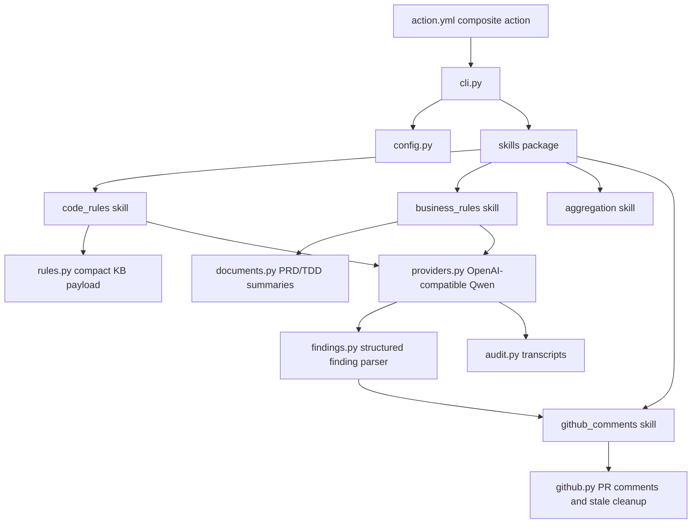
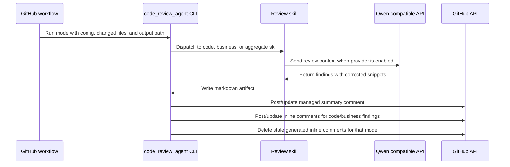

# Code Review Agent

Reusable Python agent and composite GitHub Action for the intelligent code review demo.

The agent runs after a developer opens a pull request or pushes new commits to an existing pull request. It does not create PRs. It reads repository configuration, changed files, PRD/TDD documents, and markdown rules, then writes review artifacts and publishes managed GitHub PR comments.

## Repository Role

- Own executable review logic shared by implementation repositories.
- Provide the composite GitHub Action contract in `action.yml`.
- Run code-rule, business-rule, and aggregate review modes.
- Keep full rule records for reporting while sending compact payloads to the LLM.
- Write provider request/response transcripts to `output/`.
- Publish managed summary comments and exact-line inline PR review comments.

## Non-Responsibilities

- Store coding rules. Those live in `code-review-knowledgebase`.
- Store PRD/TDD summaries permanently. Those are generated in implementation repo CI artifacts.
- Replace manual developer PR creation.

## Architecture

## Review Flow

## Modes

| Mode | Purpose | Inline comments |
| --- | --- | --- |
| `code-rules` | Review changed code against markdown coding rules from the knowledgebase. | Yes |
| `business-rules` | Summarize affected PRD/TDD documents and review implementation logic against them. | Yes |
| `aggregate` | Combine code-rule and business-rule artifacts into a final PR summary. | No, summary only |

## Action Inputs

| Input | Purpose |
| --- | --- |
| `mode` | `code-rules`, `business-rules`, or `aggregate`. |
| `config-path` | Target repo `.code-review.yml`. |
| `repository-path` | Target implementation repository checkout path. |
| `knowledgebase-path` | Checked-out `code-review-knowledgebase` path. |
| `output-path` | Markdown artifact to write. |
| `provider` | `mock` or `qwen`. |
| `comment-mode` | `dry_run` or `pr_comment`. |
| `changed-files` | Newline-separated changed file paths. |
| `audit-dir` | Directory for provider transcripts. |
| `summary-cache-ttl-days` | Freshness window for PRD/TDD summary cache. |
| `aggregate-inputs` | Newline-separated artifacts to combine in aggregate mode. |
| `pull-request-number` | PR number override for non-PR events such as `workflow_run`. |
| `head-sha` | Head SHA override for non-PR events such as `workflow_run`. |

## Provider Configuration

The current demo uses Alibaba Model Studio through an OpenAI-compatible API endpoint.

- `OPENAI_API_KEY`: required provider key.
- `OPENAI_BASE_URL`: OpenAI-compatible base URL.
- `OPENAI_MODEL`: model name.
- `GITHUB_TOKEN`: provided by GitHub Actions for PR metadata and comments.

## Findings and Comments

The agent parses model output into structured `ReviewFinding` records before rendering comments. The parser supports current markdown findings and future fenced JSON findings.

Inline comments include:

- linked finding title using the rule slug when available.
- `RuleID` and `Severity`.
- quoted reasoning.
- recommendation.
- corrected fenced code snippet when the model provides one.
- direct link to the changed line.

Generated inline comments include hidden markers. On rerun, the agent updates matching generated comments and deletes stale generated comments for the same review mode.

## Future Improvements

- Prefer provider-native structured JSON output for all findings.
- Export machine-readable finding lifecycle events to an external Hive table.
- Analyze rule effectiveness, false positives, resolved findings, unresolved findings, consumption rate, and non-consumption rate from Hive.
- Add richer aggregation that clusters duplicate code-rule and business-rule findings.
- Add integrations for Slack, Lark, or Teams notifications after review completion.
- Package the internal skill modules as externally reusable Codex skills if local developer workflows become a requirement.
