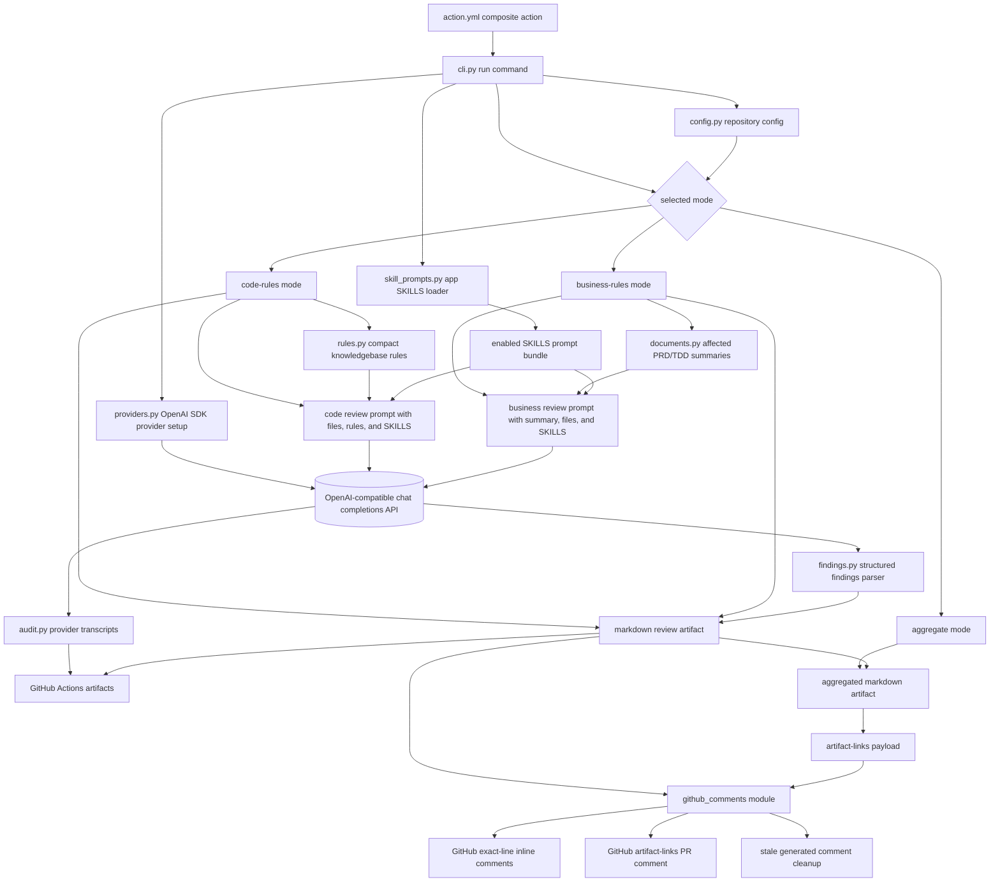
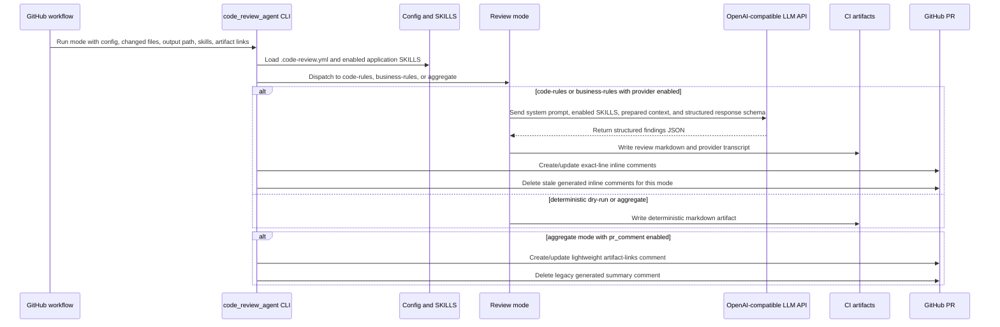

# Code Review Agent

Reusable Python agent and composite GitHub Action for the intelligent code review demo.

The agent runs after a developer opens a pull request or pushes new commits to an existing pull request. It does not create PRs. It reads repository configuration, changed files, PRD/TDD documents, and markdown rules, then writes review artifacts, publishes exact-line GitHub PR review comments, and maintains one lightweight artifact-links comment.

## References

1. Agent / GitHub Action - [https://github.com/laughingkid-sg/code-review-agent](https://github.com/laughingkid-sg/code-review-agent)
2. Implementation Example - [https://github.com/laughingkid-sg/code-review-demo](https://github.com/laughingkid-sg/code-review-demo)
3. Knowledge Base Example - [https://github.com/laughingkid-sg/code-review-knowledgebase](https://github.com/laughingkid-sg/code-review-knowledgebase)

## Repository Role

- Own executable review logic shared by implementation repositories.
- Provide the composite GitHub Action contract in `action.yml`.
- Run code-rule, business-rule, and aggregate review modes.
- Keep full rule records for reporting while sending compact payloads to the LLM.
- Use the official OpenAI Python SDK with OpenAI-compatible chat completions endpoints.
- Write provider request/response transcripts to `output/`.
- Publish exact-line inline PR review comments and a lightweight artifact-links PR comment.

## Non-Responsibilities

- Store coding rules. Those live in `code-review-knowledgebase`.
- Store PRD/TDD summaries permanently. Those are generated in implementation repo CI artifacts.
- Replace manual developer PR creation.
- Discover, create, or update pull requests. GitHub workflows provide the pull request context.
- Execute application SKILLS as plugins. SKILLS are prompt modules only.

## Architecture



## Review Flow



## Modes

| Mode | Purpose | Provider use | GitHub PR output |
| --- | --- | --- | --- |
| `code-rules` | Review changed Go files against markdown coding rules from the knowledgebase. | Optional LLM findings plus limited deterministic heuristics. | Exact-line inline comments. |
| `business-rules` | Summarize affected PRD/TDD documents and review implementation logic against those requirements. | Optional LLM summaries and findings. | Exact-line inline comments. |
| `aggregate` | Combine code-rule and business-rule artifacts into one final artifact. | None. | Lightweight artifact-links comment only. |

## Setup

### 1. Add Review Config To The Implementation Repo

Create `.code-review.yml` in the repository being reviewed:

```yaml
version: 1

repository:
  name: code-review-demo
  department: demo
  project: demo-project
  languages:
    - go

skills:
  enabled:
    - code-review-findings
    - business-requirement-tracing
    - github-inline-comments

knowledge:
  layers:
    - demo/demo-project/go
  disabled_rules: []

documents:
  summary_artifact_dir: .code-review/artifacts
  sets:
    - id: simple-api
      name: Simple API
      paths:
        prd: demo-projects/simple-api/docs/PRD.md
        td: demo-projects/simple-api/docs/TDD.md
      code_paths:
        - demo-projects/simple-api

reviews:
  code_rules:
    output: .code-review/artifacts/code-rules-review.md
  business_rules:
    output: .code-review/artifacts/business-rules-review.md

github:
  comment_mode: dry_run
```

### 2. Provide Knowledgebase Rules

The implementation repo config points to rule layers in a checked-out `code-review-knowledgebase` repository. Each layer should contain one `RULES.md`, for example:

```text
code-review-knowledgebase/
  demo/
    demo-project/
      go/
        RULES.md
```

Each rule is parsed from a level-two markdown heading with a field/value metadata table. The LLM receives a compact payload containing only review-relevant rule sections, while the artifact preserves the rule ID, slug, severity, and contributor.

### 3. Configure Provider Secrets

For deterministic local dry-runs, use `provider: mock` or `--provider mock`; no LLM credentials are needed.

For provider-backed review, set these environment variables in GitHub Actions secrets or a local `.env` file:

```bash
OPENAI_API_KEY=your-api-key
OPENAI_BASE_URL=https://api.openai.com/v1
OPENAI_MODEL=gpt-4.1-mini
OPENAI_RESPONSE_FORMAT=json_schema
```

For Qwen or another OpenAI-compatible endpoint, keep the same variables and change only the endpoint/model values:

```bash
OPENAI_API_KEY=your-provider-key
OPENAI_BASE_URL=https://dashscope.aliyuncs.com/compatible-mode/v1
OPENAI_MODEL=qwen-plus
OPENAI_RESPONSE_FORMAT=json_object
```

`OPENAI_RESPONSE_FORMAT` defaults to `json_schema`, which enables Structured Outputs for review findings. Use `json_object` when a compatible provider or selected model does not support strict JSON schema outputs.

`OPENAI_EXTRA_BODY_JSON` can pass provider-specific SDK options, such as disabling thinking mode for a CI model:

```bash
OPENAI_EXTRA_BODY_JSON='{"enable_thinking": false}'
```

## Usage

### Local Dry-Run

Run code-rule review without calling an LLM:

```bash
PYTHONPATH=/path/to/code-review-agent/src \
python -m code_review_agent run \
  --mode code-rules \
  --repository /path/to/implementation-repo \
  --knowledgebase /path/to/code-review-knowledgebase \
  --output .code-review/artifacts/code-rules-review.md \
  --changed-file demo-projects/simple-api/internal/handler/product.go \
  --provider mock \
  --comment-mode dry_run
```

Run business-rule review:

```bash
PYTHONPATH=/path/to/code-review-agent/src \
python -m code_review_agent run \
  --mode business-rules \
  --repository /path/to/implementation-repo \
  --knowledgebase /path/to/code-review-knowledgebase \
  --output .code-review/artifacts/business-rules-review.md \
  --changed-file demo-projects/simple-api/internal/handler/product.go \
  --provider mock \
  --comment-mode dry_run
```

Run aggregate mode over generated artifacts:

```bash
PYTHONPATH=/path/to/code-review-agent/src \
python -m code_review_agent run \
  --mode aggregate \
  --repository /path/to/implementation-repo \
  --output .code-review/artifacts/aggregate-review.md \
  --aggregate-input .code-review/artifacts/code-rules-review.md \
  --aggregate-input .code-review/artifacts/business-rules-review.md \
  --comment-mode dry_run
```

### Provider Smoke Test

Use this before enabling PR comments in CI:

```bash
PYTHONPATH=/path/to/code-review-agent/src \
python -m code_review_agent smoke-provider \
  --env-file /path/to/implementation-repo/.env
```

### GitHub Action Example

The implementation repository can call this composite action after checking out both repositories and computing changed files:

```yaml
name: Code Review

on:
  pull_request:
    types: [opened, reopened, synchronize]

jobs:
  code-rules:
    runs-on: ubuntu-latest
    steps:
      - uses: actions/checkout@v4
        with:
          path: implementation

      - uses: actions/checkout@v4
        with:
          repository: your-org/code-review-agent
          path: code-review-agent

      - uses: actions/checkout@v4
        with:
          repository: your-org/code-review-knowledgebase
          path: code-review-knowledgebase

      - name: Collect changed files
        id: changed
        shell: bash
        working-directory: implementation
        run: |
          git fetch origin "${{ github.base_ref }}" --depth=1
          git diff --name-only "origin/${{ github.base_ref }}"...HEAD > changed-files.txt
          {
            echo "files<<EOF"
            cat changed-files.txt
            echo "EOF"
          } >> "$GITHUB_OUTPUT"

      - uses: ./code-review-agent
        with:
          mode: code-rules
          repository-path: implementation
          knowledgebase-path: code-review-knowledgebase
          output-path: .code-review/artifacts/code-rules-review.md
          provider: llm
          comment-mode: pr_comment
          changed-files: ${{ steps.changed.outputs.files }}
          skills: |
            code-review-findings
            github-inline-comments
        env:
          OPENAI_API_KEY: ${{ secrets.OPENAI_API_KEY }}
          OPENAI_BASE_URL: ${{ secrets.OPENAI_BASE_URL }}
          OPENAI_MODEL: ${{ vars.OPENAI_MODEL }}
```

For a full workflow, run `code-rules` and `business-rules` as separate jobs, upload their markdown outputs and provider transcripts as artifacts, then run `aggregate` after both jobs complete. Pass `artifact-links` as newline-separated `label|url` values so aggregate mode can publish one compact PR comment linking to the full CI artifacts.

## Application SKILLS

Application SKILLS are markdown prompt modules loaded by the review agent at runtime and injected into provider prompts. They are not Codex desktop skills and they are not arbitrary executable plugins. Python code performs deterministic work such as reading files, parsing documents, writing artifacts, and publishing comments; SKILLS describe how the LLM should use the prepared context.

Built-in SKILLS live under `src/code_review_agent/app_skills/<name>/SKILLS.md`. Enable them in `.code-review.yml`:

```yaml
skills:
  enabled:
    - code-review-findings
    - business-requirement-tracing
    - document-markdown-normalization
    - github-inline-comments
```

The composite action also accepts a newline-separated `skills` input. When set, action/CLI skills override `skills.enabled` from config.

Current built-in SKILLS:

| Skill | Purpose |
| --- | --- |
| `code-review-findings` | Guides rule-backed code findings toward evidence-only, exact-line comments. |
| `business-requirement-tracing` | Guides business findings to cite PRD/TD summary requirements or constraints. |
| `document-markdown-normalization` | Guides use of normalized PRD/TD markdown and incomplete-conversion limitations. |
| `github-inline-comments` | Guides output toward small, non-duplicative inline PR comments. |

Future document ingestion can add deterministic converters for repo-local PDF or Word PRD/TD files, write normalized markdown artifacts, and then enable `document-markdown-normalization` so the LLM reviews the converted markdown without inventing missing content.

## Action Inputs

| Input | Purpose |
| --- | --- |
| `mode` | `code-rules`, `business-rules`, or `aggregate`. |
| `config-path` | Target repo `.code-review.yml`. |
| `repository-path` | Target implementation repository checkout path. |
| `knowledgebase-path` | Checked-out `code-review-knowledgebase` path. |
| `output-path` | Markdown artifact to write. |
| `provider` | `mock` or `llm`; `qwen` is accepted as a backwards-compatible alias. |
| `comment-mode` | `dry_run` or `pr_comment`. |
| `changed-files` | Newline-separated changed file paths. |
| `audit-dir` | Directory for provider transcripts. |
| `summary-cache-ttl-days` | Freshness window for PRD/TDD summary cache. |
| `aggregate-inputs` | Newline-separated artifacts to combine in aggregate mode. |
| `artifact-links` | Newline-separated `label|url` links for the aggregate artifact-links PR comment. |
| `skills` | Newline-separated application SKILLS names to inject into provider prompts. Overrides config `skills.enabled` when set. |
| `pull-request-number` | PR number override for non-PR events such as `workflow_run`. |
| `head-sha` | Head SHA override for non-PR events such as `workflow_run`. |

## Provider Configuration

The current demo uses the official OpenAI Python SDK against an OpenAI-compatible chat completions endpoint. Alibaba Model Studio/Qwen is one compatible configuration through `OPENAI_BASE_URL`, not a required architecture choice.

- `OPENAI_API_KEY`: required provider key.
- `OPENAI_BASE_URL`: OpenAI-compatible base URL.
- `OPENAI_MODEL`: model name.
- `OPENAI_RESPONSE_FORMAT`: optional review finding format; defaults to `json_schema` for Structured Outputs. Use `json_object` for compatible providers or models that do not support strict JSON schema outputs.
- `OPENAI_EXTRA_BODY_JSON`: optional JSON object passed through the OpenAI Python SDK as `extra_body` for provider-specific extensions.
- `GITHUB_TOKEN`: provided by GitHub Actions for PR metadata and comments.

Provider-backed review calls use `temperature=0` and `top_p=1` to keep CI output as stable as the selected model/provider allows.

## Findings and Comments

The agent asks provider-backed reviews for structured `findings[]` output, parses those records into `ReviewFinding` values, then renders markdown artifacts and exact-line GitHub comments from the parsed data. Structured Outputs use `json_schema` by default; `json_object` remains available as a compatibility fallback. Markdown parsing is kept only as a compatibility fallback for older artifacts.

Inline comments include:

- linked finding title using the rule slug when available.
- `RuleID` and `Severity`.
- quoted reasoning.
- recommendation.
- corrected fenced code snippet when the model provides one.
- direct link to the changed line.

Generated inline comments include hidden markers. On rerun, the agent updates matching generated comments and deletes stale generated comments for the same review mode.

Full review markdown, PRD/TDD summaries, and LLM transcripts are not posted as long PR summary comments. They are uploaded as GitHub Actions artifacts and linked from the aggregate artifact-links comment.

## Development

Install the package in editable mode:

```bash
python -m pip install -e .
```

Run tests:

```bash
python -m unittest
```

The package includes application SKILLS as package data via `pyproject.toml`, so installed copies can load `src/code_review_agent/app_skills/*/SKILLS.md` at runtime.

## Future Improvements

Detailed future improvements and required changes are tracked in [docs/future-improvements/README.md](docs/future-improvements/README.md).
