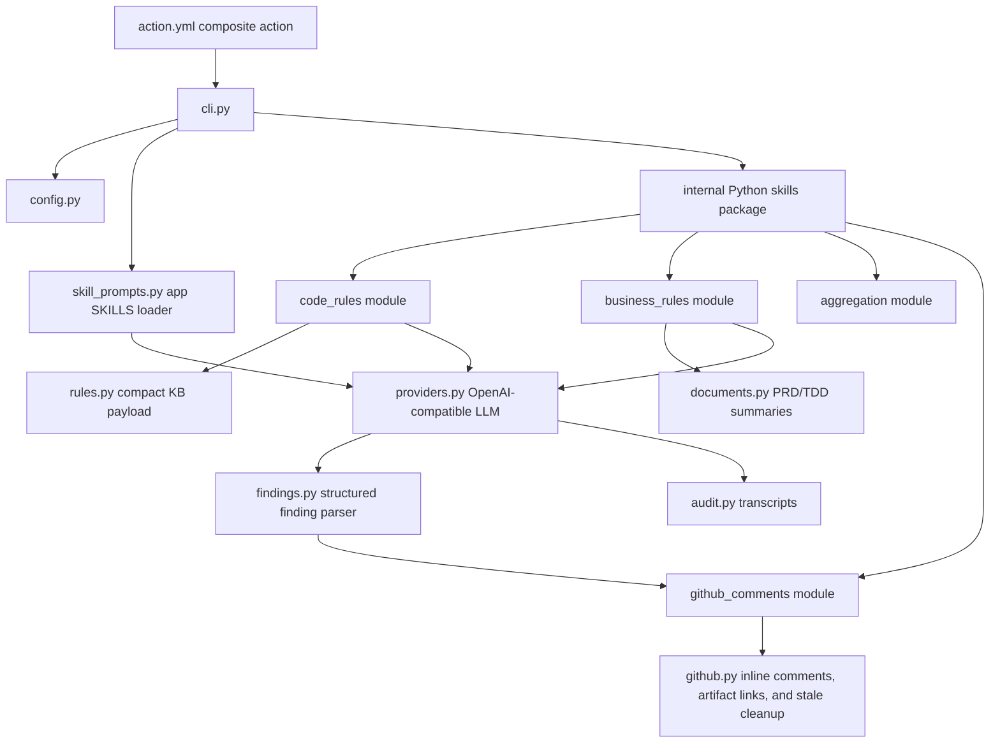
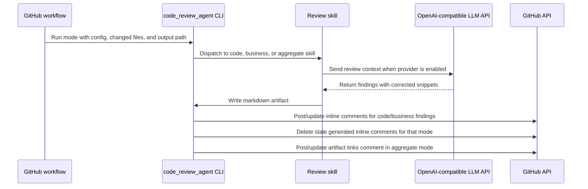

# Code Review Agent

Reusable Python agent and composite GitHub Action for the intelligent code review demo.

The agent runs after a developer opens a pull request or pushes new commits to an existing pull request. It does not create PRs. It reads repository configuration, changed files, PRD/TDD documents, and markdown rules, then writes review artifacts, publishes exact-line GitHub PR review comments, and maintains one lightweight artifact-links comment.

## Repository Role

- Own executable review logic shared by implementation repositories.
- Provide the composite GitHub Action contract in `action.yml`.
- Run code-rule, business-rule, and aggregate review modes.
- Keep full rule records for reporting while sending compact payloads to the LLM.
- Write provider request/response transcripts to `output/`.
- Publish exact-line inline PR review comments and a lightweight artifact-links PR comment.

## Non-Responsibilities

- Store coding rules. Those live in `code-review-knowledgebase`.
- Store PRD/TDD summaries permanently. Those are generated in implementation repo CI artifacts.
- Replace manual developer PR creation.

## Architecture



## Review Flow



## Modes

| Mode | Purpose | Inline comments |
| --- | --- | --- |
| `code-rules` | Review changed code against markdown coding rules from the knowledgebase. | Yes |
| `business-rules` | Summarize affected PRD/TDD documents and review implementation logic against them. | Yes |
| `aggregate` | Combine code-rule and business-rule artifacts, then publish a lightweight artifact-links comment. | No, artifact links only |

## Application SKILLS

Application SKILLS are markdown prompt modules loaded by the review agent at runtime and injected into provider prompts. They are not Codex desktop skills and they are not arbitrary executable plugins. Python code performs deterministic work such as reading files, parsing documents, writing artifacts, and publishing comments; SKILLS describe how the LLM should use the prepared context.

Built-in SKILLS live under `src/code_review_agent/app_skills/<name>/SKILLS.md`. Enable them in `.code-review.yml`:

```yaml
skills:
  enabled:
    - code-review-findings
    - business-requirement-tracing
    - document-markdown-normalization
    - github-inline-comments
```

The composite action also accepts a newline-separated `skills` input. When set, action/CLI skills override `skills.enabled` from config.

Current built-in SKILLS:

| Skill | Purpose |
| --- | --- |
| `code-review-findings` | Guides rule-backed code findings toward evidence-only, exact-line comments. |
| `business-requirement-tracing` | Guides business findings to cite PRD/TD summary requirements or constraints. |
| `document-markdown-normalization` | Guides use of normalized PRD/TD markdown and incomplete-conversion limitations. |
| `github-inline-comments` | Guides output toward small, non-duplicative inline PR comments. |

Future document ingestion can add deterministic converters for repo-local PDF or Word PRD/TD files, write normalized markdown artifacts, and then enable `document-markdown-normalization` so the LLM reviews the converted markdown without inventing missing content.

## Action Inputs

| Input | Purpose |
| --- | --- |
| `mode` | `code-rules`, `business-rules`, or `aggregate`. |
| `config-path` | Target repo `.code-review.yml`. |
| `repository-path` | Target implementation repository checkout path. |
| `knowledgebase-path` | Checked-out `code-review-knowledgebase` path. |
| `output-path` | Markdown artifact to write. |
| `provider` | `mock` or `llm`; `qwen` is accepted as a backwards-compatible alias. |
| `comment-mode` | `dry_run` or `pr_comment`. |
| `changed-files` | Newline-separated changed file paths. |
| `audit-dir` | Directory for provider transcripts. |
| `summary-cache-ttl-days` | Freshness window for PRD/TDD summary cache. |
| `aggregate-inputs` | Newline-separated artifacts to combine in aggregate mode. |
| `artifact-links` | Newline-separated `label|url` links for the aggregate artifact-links PR comment. |
| `skills` | Newline-separated application SKILLS names to inject into provider prompts. Overrides config `skills.enabled` when set. |
| `pull-request-number` | PR number override for non-PR events such as `workflow_run`. |
| `head-sha` | Head SHA override for non-PR events such as `workflow_run`. |

## Provider Configuration

The current demo uses the official OpenAI Python SDK against an OpenAI-compatible chat completions endpoint. Alibaba Model Studio/Qwen is one compatible configuration through `OPENAI_BASE_URL`, not a required architecture choice.

- `OPENAI_API_KEY`: required provider key.
- `OPENAI_BASE_URL`: OpenAI-compatible base URL.
- `OPENAI_MODEL`: model name.
- `OPENAI_RESPONSE_FORMAT`: optional review finding format; defaults to `json_schema` for Structured Outputs. Use `json_object` for compatible providers or models that do not support strict JSON schema outputs.
- `OPENAI_EXTRA_BODY_JSON`: optional JSON object passed through the OpenAI Python SDK as `extra_body` for provider-specific extensions, such as disabling Qwen thinking mode in CI.
- `GITHUB_TOKEN`: provided by GitHub Actions for PR metadata and comments.

## Findings and Comments

The agent asks provider-backed reviews for structured `findings[]` output, parses those records into `ReviewFinding` values, then renders markdown artifacts and exact-line GitHub comments from the parsed data. Structured Outputs use `json_schema` by default; `json_object` remains available as a compatibility fallback. Markdown parsing is kept only as a compatibility fallback for older artifacts.

Inline comments include:

- linked finding title using the rule slug when available.
- `RuleID` and `Severity`.
- quoted reasoning.
- recommendation.
- corrected fenced code snippet when the model provides one.
- direct link to the changed line.

Generated inline comments include hidden markers. On rerun, the agent updates matching generated comments and deletes stale generated comments for the same review mode.

Full review markdown, PRD/TDD summaries, and LLM transcripts are not posted as long PR summary comments. They are uploaded as GitHub Actions artifacts and linked from the aggregate artifact-links comment.

## Future Improvements

Detailed future improvements and required changes are tracked in [docs/future-improvements/README.md](docs/future-improvements/README.md).
