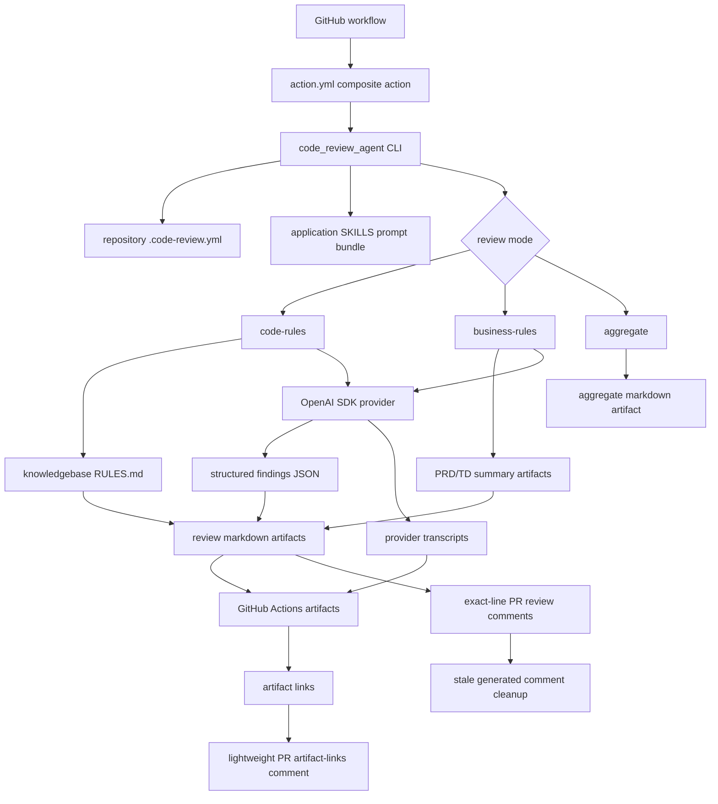

# Architecture

## Overview

The review system is split across three repositories:

- implementation repository: owns product code, PRD/TD documents, and CI artifacts.
- knowledgebase repository: owns reusable markdown review rules.
- agent repository: owns executable CI review logic and GitHub Action contract.

## Parallel Review Jobs

Two review jobs can run during the same pull request event:

- `code-rules`: checks changed code against markdown rules from the knowledgebase.
- `business-rules`: creates PR-specific PRD/TD summaries and checks implementation logic against those requirements.

Both jobs run after the developer opens a PR or pushes new commits to the PR.

## Runtime Flow

## Contributor Metadata

Rules should carry `contributor` metadata in full records. Rule metadata comes from the knowledgebase. Findings and comments should retain ID, slug, and severity as the key rule references. LLM-facing rule payloads should exclude contributor, tags, and references to reduce tokens.

## Application SKILLS

Application SKILLS are app-owned markdown prompt modules under `src/code_review_agent/app_skills/<name>/SKILLS.md`. They are loaded by `skill_prompts.py` and injected into provider prompts when enabled by `.code-review.yml` or the composite action `skills` input.

These SKILLS guide LLM behavior, but do not execute external actions. Deterministic Python modules remain responsible for file access, document parsing, artifact generation, provider calls, and GitHub comments. For example, future PDF or Word PRD/TD support should first convert repo-local documents into normalized markdown artifacts, then use a document-normalization SKILL to tell the LLM how to treat incomplete or lossy conversions.

## Artifact Ownership

Generated summaries and review reports belong to the implementation repository CI run. They should be uploaded as GitHub Actions artifacts and may also be written to `.code-review/artifacts` during local dry-runs.
